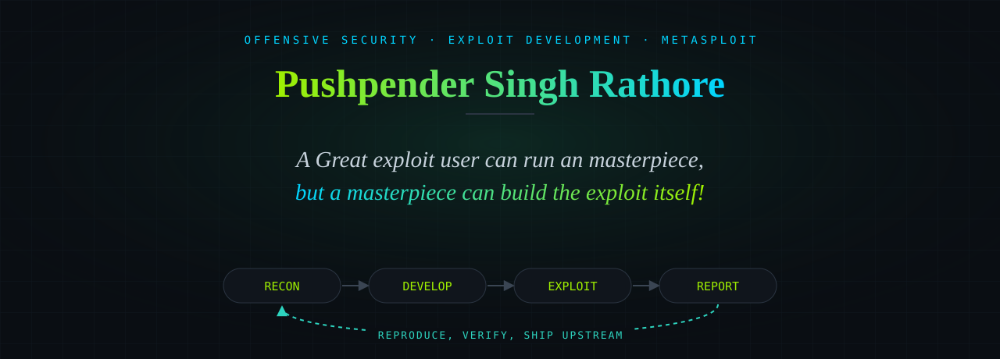

  <a href="https://pushpenderrathore.github.io/">Portfolio</a> ·
  <a href="https://pushpenderrathore.github.io/gsoc.html">GSoC 2026</a> ·
  <a href="https://www.linkedin.com/in/pushpender-singh-rathore-72466a260/">LinkedIn</a> ·
  <a href="mailto:bluedevil5177@gmail.com">Email</a> ·
  <a href="https://pushpenderrathore.github.io/prs.html">Open-source PRs</a>

---

Hi. My name is Pushpender Singh Rathore, and I am an offensive security engineer and
open-source contributor. I build the tooling and framework code that red teams and
researchers actually run, and I ship it in public where anyone can read it, break it,
and use it.

I care about one thing above the rest: making offensive security legible. A proof of
concept that no one else can reproduce, read, or trust is a liability, not a result. So I
spend most of my time on the parts that rarely get attention: the traces, the presenters,
the specs, and the clean module code that turn a fragile one-off into something an
operator can depend on. That is the loop in the banner above. Recon, develop, exploit,
report, and then the part most people skip, reproduce and verify before it ships.

Right now that work lives inside the Metasploit Framework, where I was selected for
Google Summer of Code 2026.

### What I care about

- **Reliable offensive tooling.** An exploit is only as good as the number of times it
  works on a machine that is not mine. I optimize for reproducibility, clear output, and
  code that the next person can maintain.
- **Reading systems until they break.** I did a long stretch of reverse engineering and
  protocol work, and I cannot stop. Once you have watched enough parsers and auth flows
  fail, you build everything differently.
- **Contributing upstream, in the open.** I would rather land one reviewed change in a
  tool thousands of people use than keep a hundred private scripts. Working in public is
  also the best way I know to find people who care about the same problems.

### What I have built

Everything below is that same idea, pointed at a different target.

**[Metasploit Framework](https://github.com/rapid7/metasploit-framework), Rapid7**
Google Summer of Code 2026. I am building the certificate and Kerberos tracing
subsystems, `CertificateTracePresenter` and `KerberosTicketTracePresenter`, to bring
inline X.509 and Kerberos visibility into `msfconsole`, along with merged modules and
core-library changes.

**[Unified Security Operations Framework](https://github.com/Pushpenderrathore/Unified-Security-Operations-Framework)**
A modular SOC pipeline that ties multiple security capabilities into one operational
workflow, so detection, analysis, and response live in one place instead of a drawer of
disconnected scripts.

**[payload_framework](https://github.com/Pushpenderrathore/payload_framework)**
An offensive payload generation and management framework for red-team operations, built
around repeatability rather than one-off generation.

**[Goblins](https://github.com/Pushpenderrathore/Goblins)**
An autonomous security agent that analyzes lab results and publishes its findings as a
running daemon, so the analysis loop keeps going without me.

**[Contractsd](https://github.com/Pushpenderrathore/Contractsd)**
An AES-256-GCM command-line contacts vault, with keys derived through PBKDF2-HMAC-SHA256
at 150k iterations and a per-entry salt. A small tool, taken seriously.

  
<b>More projects (earlier and experimental work)</b>

 

**[shydun](https://github.com/Pushpenderrathore/shydun)**
An SSH-based networking primitive in C, written for security research and adversary
emulation.

**[macchanger_daeion](https://github.com/Pushpenderrathore/macchanger_daeion)**
A systemd service that rotates MAC addresses on a schedule with a privacy kill-switch,
packaged for Arch, Debian, and Fedora.

**[Venice-firewall](https://github.com/Pushpenderrathore/Venice-firewall)**
A firewall that does real-time traffic anomaly analysis with adaptive filtering.

**[LUKS2-nuke](https://github.com/Pushpenderrathore/LUKS2-nuke)**
An anti-forensics wipe of a LUKS2 system after repeated failed decryption attempts.

### How I work

Languages I reach for: C, C++, Python, and Ruby, with x86 and x64 assembly when I need to
see what the machine is really doing. Daily toolchain: Ghidra, GDB, Binary Ninja,
Wireshark, Nmap, Burp Suite, and Metasploit. Tests in RSpec, because a module without a
spec is a claim without a proof.

### Where I practice

[HackTheBox](https://app.hackthebox.com/public/users/724136) ·
[TryHackMe](https://tryhackme.com/p/enp7s0d) ·
[WeChall](https://www.wechall.net/profile/rootanonymous) ·
[OverTheWire](https://overthewire.org/wargames/)

### Connect

[Portfolio](https://pushpenderrathore.github.io/) ·
[LinkedIn](https://www.linkedin.com/in/pushpender-singh-rathore-72466a260/) ·
[Email](mailto:bluedevil5177@gmail.com) ·
[All repositories](https://github.com/Pushpenderrathore?tab=repositories)
